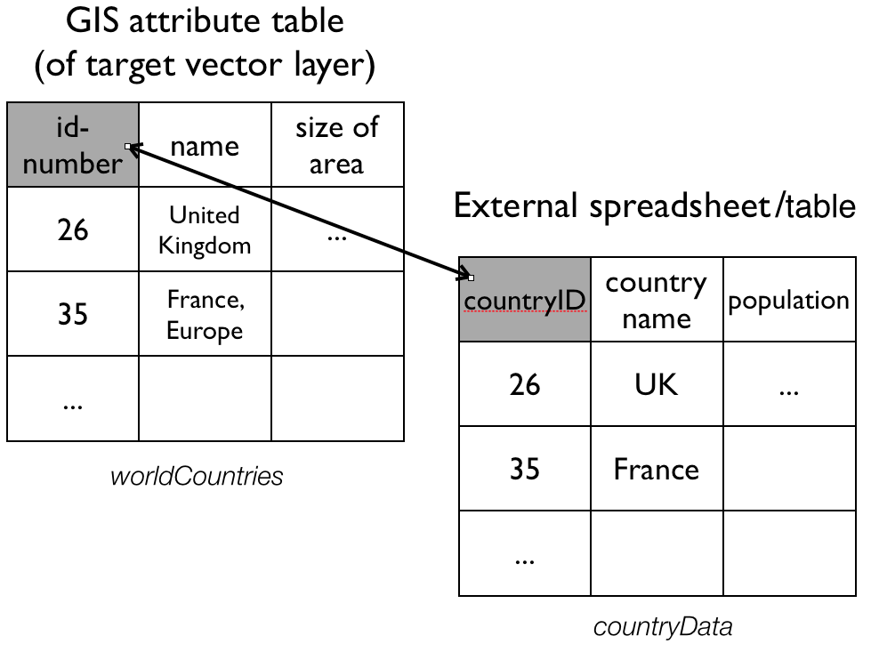

```{r setup, include=FALSE}
## libraries needed for R code examples
library(sp)
library(raster)
library(rgdal)
library(rgeos)
```
***

In this section we will look at some libraries and commands that allow us to process spatial data in R and perform a few commonly used operations.

Before we start, please make sure you have the `sp`, `rgdal`, and `rgeos` installed. For `rgdal` installation instructions refer to [this earlier notebook](https://cengel.github.io/rspatial/2_spDataTypes.nb.html). 


# 1. Attribute Join

An attribute join brings tabular data into a geographic context. It refers to the process of joining data in tabular format to data in a format that holds the geometries (polygon, line, or point). 

If you have done attribute joins of shapefiles in GIS software like _ArcGIS_ or _QGis_ you know that you need a __unique identifier__ in both the attribute table of the shapefile and the table to be joined. 

In order to combine a `Spatial*Dataframe` with another table (which would be a dataframe in R) we do exactly the same. We have a `Spatial*Dataframe`[^1] that contains the geometries and an identifying index variable for each. We combine it with a dataframe, that includes the same index variable with additional variables.

[^1]: Per the [ESRI specification](http://www.esri.com/library/whitepapers/pdfs/shapefile.pdf) a shapefile always has an attribute table, so when we read it into R with the `readOGR` command from the `sp` package it automatically becomes a `Spatial*Dataframe` and the attribute table becomes the dataframe.



The `sp` package hase a `merge` command which extends the one from the base package and works with Spatial* objects.

[^4]: The `geo_join()` command from the [`tigris` package](https://cran.r-project.org/web/packages/tigris/index.html) also provides a convenient way to merge a data frame to a spatial data frame.

Assume we have:

* a `SpatialPolygonObject` named _worldCountries_, and
* a dataframe called _countryData_ with the attribute data to join

where:

* _"id-number"_ is the colum that contains the unique identifier in _worldCountries_, and 
* _"countryID"_ is the column that contains the unique identifier in _countryData_. 

We would then say:

```
require(sp) # make sure that is loaded
worldCountries <- merge(worldCountries, countryData, by.x = "id-number", by.y = "countryID")
```
If the names of the ID columns matched, we can omit them.

***
### Exercise 1

#. Load the `rgdal` and `sp` packages.

#. Download and unzip [`RSpatialDataOps.zip`](https://www.dropbox.com/s/nrc89agtiiwf0m3/RSpatialDataOps.zip?dl=1)

#. Read the `PhillyTotalPopHHinc` shapefile into an object named `philly`.

#. Load the CSV table `PhillyEducAttainment.csv` (in the nhgisPhilly_csv folder) into a dataframe in R and name it `education`.

#. Check out the column names of `philly` and and of `edu` to determine which one might contain the unique identifier for the join. Hint: use the `names()` command. (If you are interested in what those data are, you can take a look at the codebook _PhillyEducAttainment_nhgis2010_tract_codebook.txt_)

#. Join the `edu` data frame with `philly` using `merge` as described above. Use the `names()` command to see if the join was successful.

#. Now we could plot one of the variables we just joined - but be aware that a choropleth map of the total number of the female population per census tract with a Bachelor's degree is rather meaningless. 

> Try before you peek!

```{r eval=FALSE}
library(rgdal)
library(sp)

philly <- readOGR("/Users/cengel/Desktop/RSpatialDataOps/Philly/", "PhillyTotalPopHHinc") 

edu <- read.csv("~/Desktop/RSpatialDataOps/nhgisPhilly_csv/PhillyEducAttainment.csv", sep = ";")

names(philly)
names(edu)

philly <- merge(philly, edu)

names(philly)
spplot (philly, "JN9E032")
```

***


# 2. Reprojecting
Not unfrequently you may have to reproject spatial objects that you perhaps have acquired from differnet sources and that you need to be in the same Coordinate Reference System (CRS). The `sp` package has a function called `spTransform()` that will do this for you. The function takes as a minimum the following two arguments:

* the `Spatial*` object to reproject
* a CRS object with the new projection definition

If for, example, we have an object called `MyCity` and we want to reproject this into a new projection `MyNewProjection`, we would say:

```
MyNewProjection <- CRS("definition of projection goes here as string")
spTransform(MyCity, MyNewProjection)
```

The perhaps trickiest part here is to determine the definition of the projection, which needs to be a character string in [proj4](http://trac.osgeo.org/proj/) format. You can [look it up online](http://www.spatialreference.org). For example for [UTM zone 33N (EPSG:32633)](http://spatialreference.org/ref/epsg/wgs-84-utm-zone-33n/) the string would be:

[`+proj=utm +zone=33 +ellps=WGS84 +datum=WGS84 +units=m +no_defs`](http://spatialreference.org/ref/epsg/wgs-84-utm-zone-33n/proj4js/)

You can retrieve the CRS from an existing `Spatial*` object with the `proj4string()` command. 

***

### Exercise 2

#. From the files downloaded earlier read the `PhillyHomicides` shapefile into R and name it `ph_homicides`.

#. What is the CRS of `philly`?   What is the CRS of `ph_homicides`?

#. Reproject `ph_homicides` so it matches the projection of `philly` and assign it to a new object called `ph_homicides_aea`.

#. Use `range()` and `coordinates()` to compare the coordinates before and after repojection.   

#. Compare them visually by using `plot()` 

> Try before you peek!

```{r eval=F}
ph_homicides <- readOGR("/Users/cengel/Desktop/RSpatialDataOps/PhillyCrime/", "PhillyHomicides")

proj4string(philly)
proj4string(ph_homicides)

ph_homicides_aea <- spTransform(ph_homicides, CRS(proj4string(philly)))

range(coordinates(ph_homicides))
range(coordinates(ph_homicides_aea))

par(mfrow=c(1,2)) 
plot(ph_homicides, axes=TRUE)
plot(ph_homicides_aea, axes=TRUE)
```

You should see something like:

```{r echo=FALSE, fig.height=4, fig.width=10}
ph <- readOGR("/Users/cengel/Desktop/RSpatialDataOps/PhillyCrime/", "PhillyHomicides", verbose = F)
ph_aea <- spTransform(ph, CRS(proj4string(ph)))
par(mfrow=c(1,2)) 
plot(ph, axes=TRUE)
plot(ph_aea, axes=TRUE)
```

***

In order to reproject a raster, including `SpatialGridDataFrame` objects, you will want to use the `projectRaster()` command from the `raster` package[^2], like for example:

[^2]: This has to do with the fact that a `SpatialGridDataFrame` is based on regularly spaced points. Since reprojection will typically not result in regularly spaced points as after transformation, the output of the reprojection will be coerced into a `SpatialPointsDataFrame`. It is possible but laborious to convert this back into a raster, because some interpolation needs to happen to turn unevently distributed points back into an evenly distributed grid of points. If you need to, you can convert a `SpatialGridDataFrame` to a `raster` use the `raster()` command.

```
dem.WGS84 <- projectRaster(dem.r, crs="+proj=longlat +ellps=WGS84 +datum=WGS84 +no_defs")
```
Here is a comparison of the original and reprojected [DEM](https://www.dropbox.com/s/7e62gkbajfcabh9/DEM_10m.zip?dl=1) downloaded earlier to WGS84.

```{r echo=FALSE, warning=FALSE}
dem_r <- raster("~/Desktop/RSpatialDataTypes/DEM_10m/bushkill_pa.dem")
dem_WGS84 <- projectRaster(dem_r, crs="+proj=longlat +ellps=WGS84 +datum=WGS84 +no_defs")
plot(dem_r); plot(dem_WGS84)
```


# 3. Spatial aggregation: Points in Polygons

For the next exercise we want to count all the homicides for each census tract in Philadelphia. To achieve this this we join the points of homicide incidence to the census tract polygon. You might be familiar with this operation from other GIS packages.

In R we will use the `aggregate()` function from the `sp` package[^3]. Here are the arguments that it needs:

* the `SpatialPointDataframe` with the incidents as point locations, 
* the `SpatialPolygonDataframe` with the polygons to aggregate on, and  
* an aggregate function. Examples are sum, mean, or max. Since we are just interested in counting the points, we can use `length` (of the respective vectors of the aggregated data). 


[^3]: There is also an `aggregate()` function in the `stats` package that comes with the R standard install. Note that `sp` extends this function so it can take `Spatial*` objects and aggregate over the geometric features.

***
### Exercise 3

#. Count homicides per census tract. Use `ph_homicides_aea` for homicide incidents and `philly` to aggregate on and save the result as `ph_homicides_agg`. Use `length` as aggregate function. (Look up `?sp::aggregate` if you need help.)

#. Out of couriosity try to use `ph_homicides` for homicide incidents. What happens?

#. What type of object is `ph_homicides_agg`?

#. Does it have an attribute table and if so, what does it contain?

#. How might you go about calculating the homicide ratio (i.e. normalized over the total population) per census tract?

> Try before you peek!

```{r eval=FALSE}
ph_homicides_agg <- aggregate(x = ph_homicides_aea, by = philly, FUN = length)

aggregate(x = ph_homicides, by = philly, FUN = length)  

class(ph_homicides_agg)
names(ph_homicides_agg)
head(ph_homicides_agg)

ph_homicides_agg$hom_ratio <- ph_homicides_agg$OBJECTID/philly$totalPop
spplot(ph_homicides_agg, "hom_ratio") #bad viz though
```

> --> Comment about over() and point.in.poly {spatialEco}

***


# 4. Select Polygons by Location

For the following example we will need to make use of an additional another library, called `rgeos`. Make sure you load it. 

Our goal is to select all Philadelphia census tracts within a range of 2 kilometers from the city center.

> Think about this for a moment -- what might be the steps you'd follow?

```{r eval=FALSE}
## How about:

# 1. Get the polygons
# 2. Find the city center coordinates
# 3. Create a buffer around the center
# 4. Select all polys that fall in the buffer

```


### Exercise 4

#. Get the polygons.  
We got those.  
We will reuse `philly` for the census tract polygons.

#. Find the city center coordinates.  
Ok. I will tell you:  
    Lat is 39.95258 and Lon is -75.16522. 

With this information, create a `SpatialPoints` object named `philly_ctr`.  

#. Create a buffer around the center.  
Here is where we will use the `gBuffer()` function from the `rgeos` package. The function can take a number of arguments, but for this purpose we will only need two: the __sp object__ and the __width__ of the buffer, which is assumed to be in map units. The function returns a `SpatialPolygons` object to you with the buffer - name it `philly_buf`.  
So your command would look something like  
```
philly_buf <- gBuffer(the_spatial_point_object, width = a_number_here)
```  
Now -- __before you create this buffer__, think about what you might need to do to `philly_ctr` before you proceed.

#. Select all polys that fall in the buffer.  
We will use the `gIntersects()` function from the `rgeos` package for this. The function tests if two geometries (let's name them _spgeom1_ and _spgeom2_) have points in common or not. `gIntersects` returns TRUE if _spgeom1_ and _spgeom2_ have at least one point in common.  
Here is where we determine if the census tracts fall within the buffer. In addition to our two sp objects (`philly_buf` and `philly`) we need to provide one more argument, `byid`. It determines if the function should be applied across ids (TRUE) or the entire object (FALSE) for _spgeom1_ and _spgeom2_. The default setting is FALSE. Since we want to compare _every single_ census tract polygon in our `philly` object we need to set it to TRUE.  
What class of object does `gIntersects()` return and what is its structure?  
How can you use it to select the desired polygons?

#. Plot philly, the selected polygons and the buffer. Something like the below. 

***

> Try before you peek!

```{r eval=FALSE}
library(rgeos)

coords <- data.frame(x = -75.16522, y = 39.95258) # set the coordinates
prj <- CRS("+proj=longlat +ellps=WGS84 +datum=WGS84 +no_defs") # the projection string
philly_ctr <- SpatialPoints(coords, proj4string = prj) # create the spatialPoints

philly_ctr_aea <- spTransform(philly_ctr, CRS(proj4string(philly))) # reproject!!

philly_buf <- gBuffer(philly_ctr_aea, width=2000)  # create buffer around center

philly_buf_intersects <-  gIntersects (philly_buf, philly, byid=TRUE) # determine which census tracts intersect with the buffer
class(philly_buf_intersects)
str(philly_buf_intersects)

philly_sel <- philly[as.vector(philly_buf_intersects),]

plot (philly, border="#aaaaaa")
plot (philly_sel, add=T, col="red") 
plot (philly_buf, add=T, lwd = 2)

````

```{r echo=F}
philly <- readOGR("/Users/cengel/Desktop/RSpatialDataOps/Philly/", "PhillyTotalPopHHinc", verbose = F) 
coords <- data.frame(x = -75.16522, y = 39.95258)
philly_ctr <- SpatialPoints(coords, proj4string = CRS("+proj=longlat +ellps=WGS84 +datum=WGS84 +no_defs")) 
philly_ctr_aea <- spTransform(philly_ctr, CRS(proj4string(philly))) # 
philly_buf <- gBuffer(philly_ctr_aea, width=2000)
philly_buf_intersects <-  gIntersects (philly_buf, philly, byid=TRUE)
philly_sel <- philly[as.vector(philly_buf_intersects),]
plot (philly, border="#aaaaaa")
plot (philly_sel, add=T, col="red") 
plot (philly_buf, add=T, lwd = 2)

```

