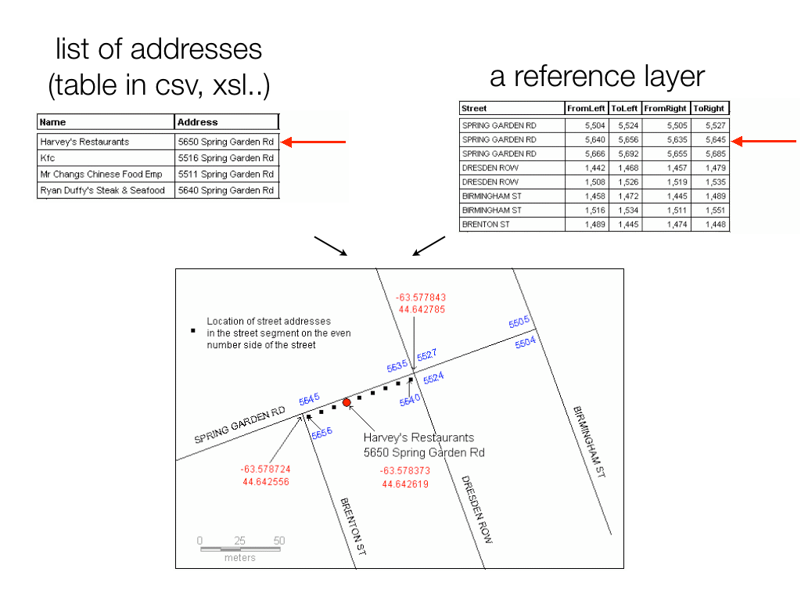

```{r setup, include=FALSE}

# load additional libraries for below
library(ggmap)
library(sp)
library(rgdal)
library(httr)
library(jsonlite)
library(leaflet)
```

Libraries needed for this section are:

* `ggmap`
* `readr`
* `sp`
* `rgdal`
* `httr`
* `jsonlite`


Data needed:

* [Some addresses](https://www.dropbox.com/s/z0el6vfg1vtmxw5/PhillyBanks_sm.csv?dl=1)

# 1. About geocoding 
## What is Geocoding?

- "**Geocoding** is the process of transforming a description of a location (such as an address, name of a place, or coordinates) to a location on the earth's surface." 
- "A **geocoder** is a piece of software or a (web) service that implements a geocoding process i.e. a set of inter-related components in the form of operations, algorithms, and data sources that work together to produce a spatial representation for descriptive locational references."
- "**Reverse geocoding** uses geographic coordinates to find a description of the location, most typically a postal address or place name." (I rarely have needed to do this.)[^1]

[^1]: From: https://en.wikipedia.org/wiki/Geocoding

## How is it done?

There are a number of ways, for example:

- **Interpolation** for Street adresses



- **Rooftop Level** for Street adresses

- Open access **gazetters or databases** for location/place names (http://geonames.org or http://geonames.usgs.gov/pls/gnispublic/) or IP adresses (http://freegeoip.net)

## Issues
- **Quality of input data** or: how specific is your location information?
- **Quality of output data**: return rate, accuracy and precision
- **Regional differences**: Geocoding adresses in the US is a different from than geocoding in Nigeria or Germany. Geocoding adresses in suburban Chicago is different from geocoding in rural Alabama.
- **Limitations of geocoding services**: Bulding and maintaining an accurate global geocoding service is very resource intensive. So is running a geocoding server, particularly if it is hit with millions of requests per second. For that reason geocoding services are usually very limited in what they offer for free, if at all. Secondly, the results returned usually vary from service to service in terms of accuracy and values returned.

# 2. About APIs
## What is an API and what does it have to do with geocoding?

***
### Exercise 1

#. Go to your browser.

#. Point it to: http://maps.googleapis.com/maps/api/geocode/xml?address=Stanford+CA

#. What just happened?

#. Now write the URL to return the location of Toledo -- what do we get here? 

#. Now we want the city in Spain. Extra bonus: Request the results in JSON format. 

Here is some documentation: https://developers.google.com/maps/documentation/geocoding/

```{r eval=F}
http://maps.googleapis.com/maps/api/geocode/xml?address=Toledo

http://maps.googleapis.com/maps/api/geocode/json?address=Toledo&region=ES

# this also works:
http://maps.googleapis.com/maps/api/geocode/json?address=Toledo,Spain
```

What have we learned?

> - We can use an API to access a service (or tools) provided by someone else without knowing the details of how this service or tool is implemented.
      
> - A geocoding API provides a direct way to access these services via an HTTP request (simply speaking: a URL).

> - A geocoding service API request must be in a particular form as specified by the service provier.

> - Geocoding services responses are returned in a structured format, which is typically XML or JSON, sometimes also KMZ. 

Our goal is now to do what we did in a web browser from R. For this we have to take into account also:

- **Authentication**: Using geocoders often may require a valid API key. The key can usually be requested for free by registering at the website of the provider.

- **Rate Limiting**: Geocode service providers typically use a rate limiting mechanism to ensure that the service stays available to all users.

There are many geocoding providers[^2]. They vary in terms of format specifications, access and use(!) resrictions, quality of results, and more. So choosing a geocoder for a research project depends on the specifics of your situation. 

[^2]: For a quite comprehensive overview look [here](https://docs.google.com/spreadsheet/ccc?key=0AidEWya_p6XFdGw1RmZ6TjB1ajZxVk81d2pISDMzVUE&usp=sharing) and [here](http://geoservices.tamu.edu/Services/Geocode/OtherGeocoders/). 

## Generic structure of a geocoding script

If you were to write your own script, here are the basic steps to take.

#. Load address data. Clean them up if necessary.

#. Send each address to the geocoding service (typically: create a URL request for each address)

#. Process results. Extract geogrpahic coordinates and any other values you are interested in and turn into into a convenient format, usually a table.

#. Save the output.


# 3. Geocoding with the Google maps API

## Interactively 

We will start by using the `geocode()` command from the `ggmap` library. 

***
### Exercise 2

1. Install (if you haven't) and load the `ggmap` library.

2. Using the `geocode` command, how would you search for location of the city of Toledo

```{r eval=FALSE}
library(ggmap)
geocode("Toledo")
```

3. How does your result compare to what you got from when you did the query through the web browser? Check out the `output=` option of the command, what does that do?

```{r eval=FALSE}
geocode("Toledo", ouput = "all")
```

4. Now geocode this address: `"380 New York St, Redlands, CA"`. Compare the results you get with the Google geocoder versus the Data Science Toolkit geocoder.

```{r eval=FALSE}
geocode("380 New York St, Redlands, CA")
geocode("380 New York St, Redlands, CA", source = "dsk")
```

## Batch geocoding

Now let's write an R script to process an entire list of adresses for geocoding this way. We will use the generic outline above and implement it in R.

***
### Exercise 3

1. Load address data.  

    Let's use the addresses of declared dangerous dogs in Austin, TX, courtesy of the [city of Austin's open data portal](https://data.austintexas.gov). 

    The direct link to the CSV file of the data is this one:

    https://data.austintexas.gov/api/views/ykw4-j3aj/rows.csv?accessType=DOWNLOAD

    Read the table into R and call it `dogs`.

```{r eval=FALSE}
dogs <- read.csv("https://data.austintexas.gov/api/views/ykw4-j3aj/rows.csv?accessType=DOWNLOAD")
```

2. Send each address to the geocoding service. 
    
    The nice thing is that `geocode()` can take a vector of adresses. So all we have to do is find out where the addresses are in our `dogs` data frame and then submit them to the `geocode()` function. And of course, catch the results in a variable.

    (For the purpose of this exercise we will overlook the fact that the coordinates already come with the table.)

```{r eval=FALSE}
# concatenate the address
dogs_adr <- paste(dogs$Address, "Austin,TX", dogs$Zip.Code)

# geocode - check for warnings
dogs_coords <- geocode(dogs_adr)
```

3. Process results. 

    Most of this is all taken care of already in the `geocode()` function, which returns a vector of geographic coordinates. All we need to do is bind it the back to our original dataframe. 

```{r eval=FALSE}
dogs <- data.frame(cbind(dogs, dogs_coords))
```

4. Save the output as shapefile. 
    
    Saving the coordinates out as csv is pretty easy with `write.table()`. To save the data frame as a shapefile, we convert the dataframe to a `Spatial*Dataframe` first, assign a projection, and then save with `writeOGR()`. Remember that you will need both the `sp` and the `rgdal` libraries for this. 
    
    Optional: save the shapefile using `sf`.
    
```{r eval=FALSE}
library(sp)
library(rgdal)

dogs <- dogs[complete.cases(dogs),] # remove NA geocoding results 
coordinates(dogs) <- c("lon", "lat") 
proj4string(dogs) <- CRS("+proj=longlat +ellps=WGS84 +datum=WGS84 +no_defs")
writeOGR(dogs, ".", "dangerous_dogs", driver="ESRI Shapefile")


# If we were to use the `sf` package we would do:
    
library(sf)
dogs_sf <- st_as_sf(dogs, c("lon", "lat"), crs = "+proj=longlat +ellps=WGS84 +datum=WGS84 +no_defs")
st_write(dogs_sf, "dangerous_dogs.shp")

```
    

5. Now let's use `leaflet()` to plot the dots over a basemap.

```{r eval=FALSE}
leaflet(dogs) %>%  
  addTiles() %>% 
  addCircleMarkers(dogs$lon, dogs$lat, popup=dogs$Description.of.Dog) 
```

Something like this:

```{r echo=FALSE, message=FALSE, warning=FALSE, comment=NA}
dogs <- read.csv("https://data.austintexas.gov/api/views/ykw4-j3aj/rows.csv?accessType=DOWNLOAD")
#dogs_adr <- paste(dogs$Address, "Austin,TX", dogs$Zip.Code)
dogs_adr <- paste(dogs$Address, "Austin,TX", dogs$Zip.Code)
dogs_coords <- geocode(dogs_adr)
dogs <- data.frame(cbind(dogs, dogs_coords))
dogs <- dogs[complete.cases(dogs),] # remove NA geocoding results 

leaflet(dogs) %>%  
  addTiles() %>% 
  addCircleMarkers(dogs$lon, dogs$lat, popup=dogs$Description.of.Dog) 
```


# 4. Geocoding with the ArcGIS API (Stanford affiliates only)

Thanks to our fabulous geospatial manager [Stace Maples](https://library.stanford.edu/people/maples) who is tirelessly working to make our GIS lives easier we have our own geolocator at Stanford at

>> http://locator.stanford.edu/arcgis/rest/services/geocode

The services available here cover the US only. The good news here are that there are no limits as of how many addresses you can throw at this server. However, **you should let Stace know if you are intending to run a major job!**

You can find more details as of how to use this service from R [here](https://github.com/cengel/ArcGIS_geocoding).


***
### Exercise 4

#. Using the provided function `geocodeSL` we can geocode the adress table from above using the ArcGIS geocoding service:

```{r eval=FALSE}
library(readr)
library(rgdal)

# set your token
myToken <- "XXXXXXXX"

# source the function
source("https://raw.githubusercontent.com/cengel/ArcGIS_geocoding/master/SUL_gcFunctions.R")

# geocode
dogs_coords2 <- do.call("rbind", lapply(dogs_adr, function(x) geocodeSL(x, myToken)))

# add attibutes back
dogs2 <- cbind(dogs, dogs_coords2)

# write out a CSV
write.csv(dogs2, "dangerous_dogs2.csv", row.names=F)

```

# 5. More geocoding services and libraries

## Other R libraries

`ggmap` is certainly not the only R library that includes a geocoding function. The libraries below also do geocoding with different services:

- [`googleway`](https://CRAN.R-project.org/package=googleway) also connects to Google 

- [`tmap`](https://CRAN.R-project.org/package=tmap) connects to [OSM Nominatim](http://nominatim.openstreetmap.org)

- [`nominatim`](https://github.com/hrbrmstr/nominatim) (not on CRAN) connects to [OSM Nominatim](http://nominatim.openstreetmap.org)

- [`opencage`](https://CRAN.R-project.org/package=opencage) connects to [OpenCage geocoder](https://geocoder.opencagedata.com/) 

- [threewords](https://CRAN.R-project.org/package=threewords) connects to the [What3Words](http://what3words.com/) 

For more see the Geolocation/Geocoding secion on the CRAN Task View for [Web Technologies and Services](https://CRAN.R-project.org/view=WebTechnologies).


## A word about Open Data Science Toolkit (DSK)

The open Data Science Toolkit (DSK) is available as a self-contained Vagrant VM or EC2 AMI that you can deploy yourself. It includes a Google-style geocoder which emulates Google's geocoding API. This API uses data from the US Census and OpenStreetMap, along with code from GeoIQ and Schuyler Erle's Modular Street Address Geocoder.

Insructions for how to run DSK on Amazon or Vagrant are here: http://www.datasciencetoolkit.org/developerdocs#amazon

Note that `geocode` from `ggmap` also has the option to access DSK, but it will use their public server, which is often slow or unavailable.

## Geocoding IP adresses

If you are interested to do this in R see here: https://github.com/cengel/r_IPgeocode 


# 6. Putting it all together: Webscraping for maps

Now for fun. We will retrieve a table from the [Wikipedia page on Crime statistics U.S. cities with a population of 250,000 or greater](http://en.wikipedia.org/wiki/List_of_United_States_cities_by_crime_rate#Crime_rates_per_100.2C000_people_.282012.29). 
We will use the city names, geocode their locations and plot the cities by population and crime rate.

You should be able to run the code below as is. It might take a little while.

***
### Exercise 5
```{r message=FALSE, warning=FALSE, comment=NA}
library(XML)
library(ggmap)
library(dplyr)
library(RCurl)

# read in the data
uri <- "https://en.wikipedia.org/wiki/List_of_United_States_cities_by_crime_rate"
# we want the second table: which=2
citiesCR <- readHTMLTable(getURL(uri), which = 2, stringsAsFactors = FALSE)

# clean up (with mutate_each function from dplyr): 
# remove the comma in 1,000 and above and convert numbers from strings to numeric
citiesCRclean <- mutate_each(citiesCR, funs(as.numeric(gsub(",", "", .))),  -(State:City))
 
# geocode loations
latlon <- geocode(paste(citiesCRclean$City, citiesCRclean$State, sep=", "))

# combine into a new dataframe
citiesCRll <- data.frame(citiesCRclean, latlon)

#get basmap
map_us <- get_map (location='United States', zoom=4, color="bw")

# plot
ggmap(map_us, legend='bottomright', extent='device') +
  geom_point(data=citiesCRll,
            aes(x=lon, y=lat, 
            color=Violent.Crime, 
            size=Population),
            na.rm=T) +
  scale_colour_gradient(low="white", high="red") +
  scale_size_continuous(range = c(4,12))
```
